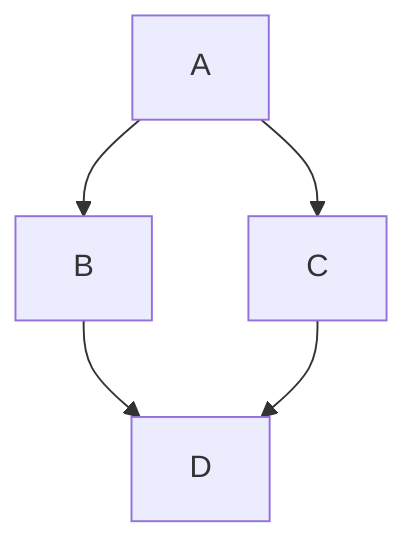

# hexo-plugin-mermaid-js-diagrams

Hexo plugin for rendering Mermaid.js diagrams with interactive controls.

## Features

- 🎨 Mermaid support
- 🎮 Interactive controls: zoom in/out, reset, download SVG, fullscreen
- 🖱️ Draggable controls and diagrams
- ⚙️ Fully configurable positioning and behavior
- 📦 Zero configuration required (works out of the box)

## Installation

```shell
npm i hexo-plugin-mermaid-js-diagrams
```

## Configuration

Add to your `_config.yml`:

```yaml
mermaid:
  enable: true
  theme: default
  js_url: https://cdn.jsdelivr.net/npm/mermaid/dist/mermaid.min.js  # optional, defaults to local mermaid.min.js
  priority: 0  # optional, filter execution priority (default: 0)
  markdown: false  # enable markdown code fence syntax (```mermaid)
  controls:  # optional, interactive controls
    enable: true  # enable/disable all controls
    zoomIn: true  # show zoom in button (🔍)
    zoomOut: true  # show zoom out button (🔎)
    reset: true  # show reset button (↺)
    download: true  # show download SVG button (💾)
    position: bottom-right  # button position: top-left, top-right, bottom-left, bottom-right
    draggable: true  # allow dragging controls to reposition
  diagramDraggable: true  # allow dragging diagram to reposition
  width: 100%  # diagram container width (e.g., 100%, 800px, 50vw)
  debug: false  # enable console logging for troubleshooting
```


## Usage

### Hexo Tag Syntax

```

graph TD;
    A-->B;
    A-->C;
    B-->D;
    C-->D;

```

### Markdown Code Fence Syntax

Enable with `markdown: true` in config:

````markdown

````


```yaml
prism:
  line_number: true
  tab_replace: ''
```
## Security

⚠️ This plugin executes Mermaid.js in the browser. Ensure diagram content is from trusted sources to avoid potential security risks.

## Repository

https://github.com/neoalienson/hexo-plugin-mermaid-js-diagrams

## License

MIT
